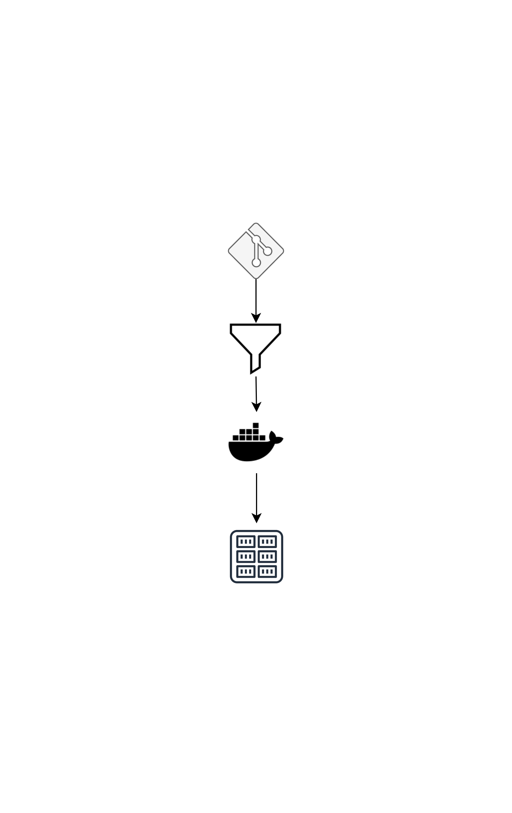
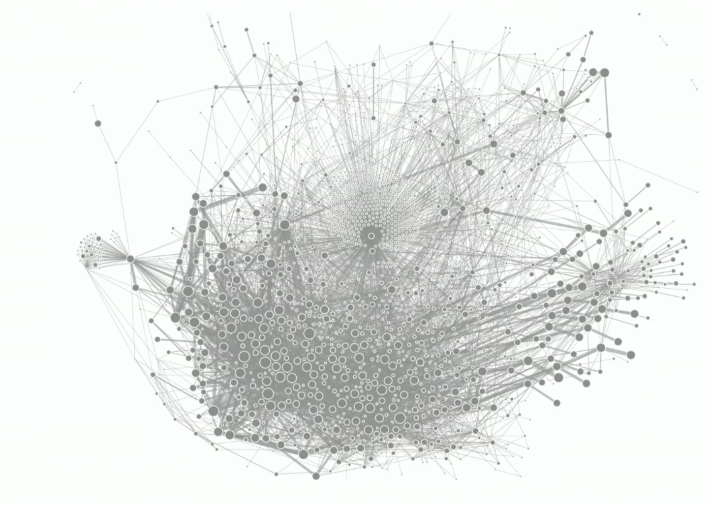

<!-- _paginate: false -->

# DevOps med Xenit

En introduktion till DevOps

<!--
Presenter notes.
-->

---

<!-- _paginate: false -->
<!-- _class: lead -->

# Agenda

- Introduktion (15 min)
- Varför DevOps-kulturen och var kommer den ifrån (30 min)
- Paus (15 min)
- Hur jobbar företag för att främja kulturen (30 min)
- Vilka verktyg och arbetssätt möjliggör kulturen (30 min)

<!--
Presenter notes.
-->

---


# Introduktion

Vilka är vi?

- Xenit AB
- Philip Laine
- Simon Gottschlag

<!--
Presenter notes.
-->

---


# Xenit AB

Vi realiserar dina digitala drömmar:

Med säkra och moderna tjänster skapar vi frihet.

<!--
Vårt syfte är att skapa frihet för människor. Våra tjänster möjliggör distansarbete, samarbete mellan kontor och ger frihet i val av enheter, arbetstider och arbetsplats.

Kunder så som: Afry, Lindex, HSB
-->

---


# Introduktion

## Philip Laine

DevOps specialist

<!--
Presentation av Philip
-->

---


# Introduktion

## Simon Gottschlag

CTO

<!--
Presentation av Simon
-->

---


# Varför DevOps

Mer värde snabbare genom rätt kultur och verktyg

- Gladare utvecklare
- Mer värde för pengarna
- Bättre produkter
- Alla har sina åsikter

<!--
Software is cool but useless if nobody wants it

- Feature development is slow
- Deployment to production is slow
- Feedback from end user is slow
-->

---


# Vad är DevOps

"De blinda männen beskriver en elefant"

- Verktyg
- Kultur
- Filosofi
- Arkitektur
- Planering

<!--
Alla beskriver det olika.

De blinda männen skall beskriva en elefant:
- Den som känner på snabeln: Det är som en orm
- Den som känner på örat: Det är som en fläkt
- Den som känner på benet: Det är som ett träd
- Den som känner på magen: Det är som en vägg
- Den som känner på bete: Det är som ett spjut
- Den som känner på svansen: Det är som ett rep
-->

---


# Vad är DevOps

DevOps är mötesplatsen för:

- människor
- processer
- produkter

För att möjliggöra kontinuerlig leverans av värde till slutanvändare.

<!--
Mer information...
-->

---


## Versionshantering

Använd versionshantering för allt

<!--
- Infrastructure as Code
- Code review
- Presentations as Code
- Documentation as Code
-->

---


## Automatisering

Automatisera deployment och tester

<!--
- Allt du gör kan automatiseras
- Se till att göra automatisering tillgängligt lokalt
- Se till att alla tester kan köras hela tiden
-->

---


## CI / CD

Implementera continuous integration / continuous delivery

<!--
- Exekvera byggen vid commit
- Kör tester vid pull request
- Automatisk deployment till olika environments
- Tester mot olika environments
-->

---


## Trunk based

Använd trunk-based development-metoder

<!--
- Jobba med små förändringar ("small batches")
- Motverka merge konflikter
- Små branches för förändringar
- Utför merge ofta
-->

---


## Microservices

Löst kopplad arkitektur

<!--
- Enklare att förändra små tjänster
- Mindre tester, snabbare byggen, fler releaser
- Mer agilt, snabbsare time to market
- Mindre beroenden mellan tjänster
- Möjlighet att välja rätt språk för rätt tjänst
-->

---


## Autonoma team

Arkitektur för att möjliggöra autonoma team

<!--
- Exponera kontrakten mellan teamen
- Testa kontrakten
- "Cell based architecture"
- Se till att varje team kan jobba på det sättet som gör dem mest effektiva
- Skapa good practices och guidelines, men tvinga inte
- Jobba aktivt med Developer Experience
-->

---


## Fail fast

Främja och möjliggör experiment

<!--
- Våga experimentera
- Bättre misslyckas tidigt än sent
- Testa koncept och hypoteser så billigt som möjligt
-->

---

<!-- _footer: "" -->


# PAUS

---

<!--

# Övriga Framgångsfaktorer

- Enkel change management
- Använd data från övervakning för att ta beslut
- Arbeta proaktivt med att upprätthålla hälsan på systemen
- Jobba med WIP (work-in-process) begränsningar
- Visualisera hur arbete utförs
- Främjar kulturen:
  - Informationsflöden genom organisationen
  - Samarbete och tillit
  - Korsfunktionella team
- Investera i att alla lär sig och utvecklas

-->

# Verktyg

- Hur gör jag rent praktiskt?

---

# Wall of Confusion

- Motsatsen till DevOps
- Dev utvecklar på lokala maskiner som är alla unika
- Ops kör applikationer utan att veta något om den
- Ingen är glad


<!--
Presenter notes.
- There is more to it than just the app
  - We have dependencies, os, etc.
- How do we avoid throwing the app over the wall?
- What tools are there that we can use
-->

---

# Docker


<!--
Presenter notes.

- Docker is a tool that simplifies working with Linux containers.
- A container is an efficient way to snapshot code, dependencies and OS into a single binary.
-->

---

# Exempel

```Dockerfile
FROM node:slim
WORKDIR /usr/src/app
COPY package*.json ./
RUN npm install
COPY . .
CMD [ "node", "main.js" ]
```

```shell
docker build --tag webapp .
docker run webapp
```

<!--
Presenter notes.

- Removes need to understand development infra.
- Snapshots allows for an image to always work.
- Configuration should be kept separate.
-->

---

# Continuous Integration (CI)

Keep it simple stupid



<!--
Presenter notes.
-->

---

# Värt att fråga
- Hur mycket "vet" min applikation?
- Vem påverkas av min förändring?
- Hur många syften uppfyller min applikation

---

# Resultat



<!--
Presenter notes.
- Is this architecture good?
- Dare to try to explain why something is good or bad.
-->

---

# Lösningar skapar problem

<!-- _class: lead -->

---

# Nya problem
- Starta en container på en server
- Skicka konfiguration till en container
- Kommunikation mellan containers
- Skala min container
- Trafik från internet till min container
- Disk för min container
- Allokera RAM och CPU för min container

---

# Kubernetes
Kubernetes is a portable, extensible, open-source platform for managing containerized workloads and services, that facilitates both declarative configuration and automation. It has a large, rapidly growing ecosystem. Kubernetes services, support, and tools are widely available.

---

# Varför ska jag bry mig?
- Jag har en Java backend
- Jag vill vara säker på att den alltid kör
- Jag vill snabbt göra förändringar

---

## Books

- [The Phoenix Project](https://www.goodreads.com/book/show/17255186-the-phoenix-project)
- [The Unicorn Project](https://www.goodreads.com/book/show/44333183-the-unicorn-project)
- [The Goal](https://www.goodreads.com/book/show/113934.The_Goal)
- [Accelerate](https://www.goodreads.com/book/show/35747076-accelerate)
- [Making Work Visible](https://www.goodreads.com/book/show/36458712-making-work-visible)
- [The Pragmatic Programmer](https://www.goodreads.com/book/show/4099.The_Pragmatic_Programmer)

---

## Podcasts

- [Kubernetes Podcast](https://kubernetespodcast.com/)
- [The New Stack Makers](https://thenewstack.io/podcasts/makers/)
- [The Cloudcast](https://www.thecloudcast.net/)

---

## Links

- [Docker](https://www.docker.com/)
- [Kubernetes](https://kubernetes.io/)
- [CNCF](https://www.cncf.io/)
- [Kind](https://github.com/kubernetes-sigs/kind)
- [Kubernetes Slack](https://slack.k8s.io/) (#se-users)
- [Cloud Native GBG](https://www.meetup.com/TheCloudNativeGbg/)

---

## Links

- [State of DevOps 2019](https://services.google.com/fh/files/misc/state-of-devops-2019.pdf)
- [OWASP Top 10](https://owasp.org/www-project-top-ten/)
- [Cell-Based Architecture](https://github.com/wso2/reference-architecture/blob/master/reference-architecture-cell-based.md)
- [CKA Udemy](https://www.udemy.com/course/certified-kubernetes-administrator-with-practice-tests/)

<!--
Presenter notes.
-->
