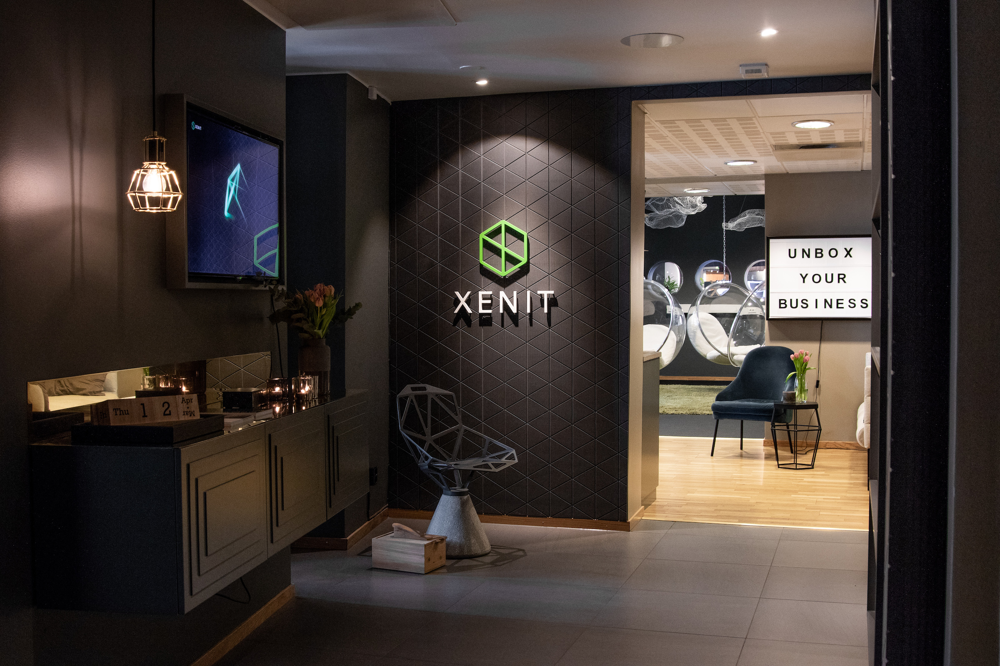
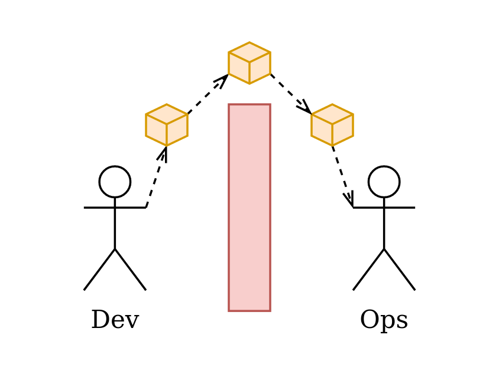

<!-- _paginate: false -->

# DevOps med Xenit

En introduktion till DevOps

<!--
Presenter notes.
-->

---

<!-- _paginate: false -->
<!-- _class: lead -->

# Agenda

- Introduktion (15 min)
- Varför DevOps-kulturen och var kommer den ifrån (30 min)
- Paus (15 min)
- Hur jobbar företag för att främja kulturen (30 min)
- Vilka verktyg och arbetssätt möjliggör kulturen (30 min)

<!--
Presenter notes.
-->

---

# Introduktion

Vilka är vi?

- Xenit AB
- Philip Laine
- Simon Gottschlag

<!--
Presenter notes.
-->

---

# Xenit AB

Vi realiserar dina digitala drömmar:

Med säkra och moderna tjänster skapar vi frihet.

<!--
Vårt syfte är att skapa frihet för människor. Våra tjänster möjliggör distansarbete, samarbete mellan kontor och ger frihet i val av enheter, arbetstider och arbetsplats.

Kunder så som: Afry, Lindex, HSB
-->

---

# Introduktion

## Philip Laine

DevOps specialist

<!--
Presentation av Philip
-->

---

# Introduktion

## Simon Gottschlag

CTO

<!--
Presentation av Simon
-->

---

# Varför DevOps

Mer värde snabbare genom rätt kultur och verktyg

- Gladare utvecklare
- Mer värde för pengarna
- Bättre produkter
- Alla har sina åsikter

<!--
Software is cool but useless if nobody wants it

- Feature development is slow
- Deployment to production is slow
- Feedback from end user is slow
-->

---

# Vad är DevOps

"De blinda männen beskriver en elefant"

- Verktyg
- Kultur
- Filosofi
- Arkitektur
- Planering

<!--
Alla beskriver det olika.

De blinda männen skall beskriva en elefant:
- Den som känner på snabeln: Det är som en orm
- Den som känner på örat: Det är som en fläkt
- Den som känner på benet: Det är som ett träd
- Den som känner på magen: Det är som en vägg
- Den som känner på bete: Det är som ett spjut
- Den som känner på svansen: Det är som ett rep
-->

---

# Vad är DevOps

DevOps är mötesplatsen för:

- människor
- processer
- produkter

För att möjliggöra kontinuerlig leverans av värde till slutanvändare.

<!--
Mer information...
-->

---

# Produktivitet

<!-- Måste justeras efter dagens siffror -->

| Företag       | Frekvens  | Ledtid  | Pålitlighet |
| ------------- | --------- | ------- | ----------- |
| Amazon        | 23000/dag | Minuter | Hög         |
| Google        | 5500/dag  | Minuter | Hög         |
| Netflix       | 500/dag   | Minuter | Hög         |
| Facebook      | 1/dag     | Timmar  | Hög         |
| Twitter       | 3/vecka   | Timmar  | Hög         |
| Vanliga bolag | 1/kvartal | Månader | Låg         |

<!--
Mer information...
-->

---

# Key success factors

- Använd versionshantering för allt
- Automatisera deployment och tester
- Implementera continuous integration / continuous delivery
- Använd trunk-based development-metoder
- Injecera säkerhet i alla steg
- Löst kopplad arkitektur
- Arkitektur för att möjliggöra autonoma team

<!--
Mer information...
-->

---

# Key success factors

- Enkel change management
- Automatisera deployment och tester
- Implementera continuous integration / continuous delivery
- Använd trunk-based development-metoder
- Injecera säkerhet i alla steg
- Löst kopplad arkitektur
- Arkitektur för att möjliggöra autonoma team

<!--
Mer information...
-->

---

# Wall of Confusion

<!--
Presenter notes.
-->

---

# The Big Switch

<!--
Presenter notes.
-->

---

# Stability vs Adaptability

There has to be a better way

<!--
Presenter notes.
-->

---

# How

DevOps is an idea not a thing

- Requires investment from all stakeholders
- Is built around communication

<!--
Presenter notes.
-->

---

# What

Software as a communication tool

- Tools can reduce the amount of human communication
- Reduces can reduce risk of things going wrong

<!--
Presenter notes.
-->

---

# Way of working

A good deciesion is one that can be reversed

- Separation of responsibilities
- Lose coupling between components

<!--
Presenter notes.
-->

---

# Docker

Tool which allows you to bind code, dependencies and OS into a single small and efficient binary.

<!--
Presenter notes.
-->

---

# Demo

<!--
Presenter notes.
-->

---

# References

- Books

  - The Phoenix Project
  - The Unicorn Project

- Websites

- Podcasts

- Tools

<!--
Presenter notes.
-->

---
