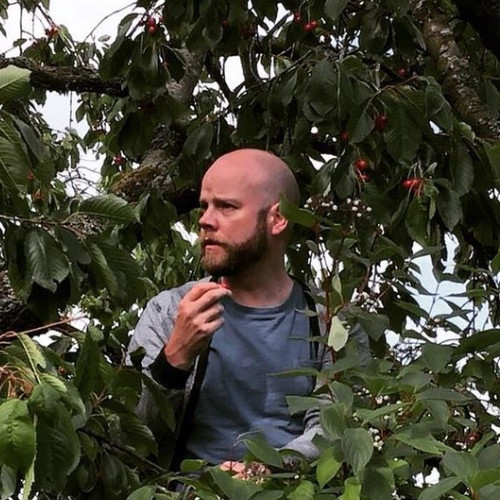
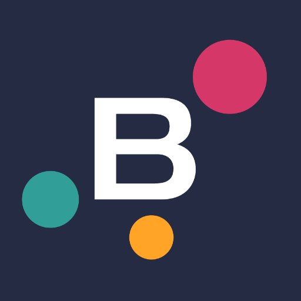
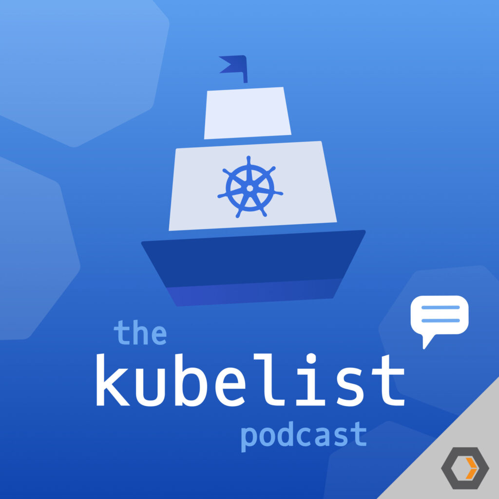

<!-- _paginate: false -->
<!-- _class: lead -->

# Cloud Native GBG Meetup
## #14
---

<!-- _paginate: false -->
<!-- _class: lead -->

# Agenda

- 18.00 - 18.15 Introduction
- 18.15 - 18.45 Kubernetes v1.19
- 18.45 - 19.15 Cloud Native and Machine Learning at the edge

---

# Anders Eknert

- Developer Advocate
- Bisnode

---

# Anders Björklund

- System Developer
- ECSIT

---

<!-- _class: lead -->

## #se-users @ Kubernete Slack
### Kubernetes Slack: https://slack.k8s.io/

---

<!-- _class: lead -->

# Contact Me

- philip.laine@xenit.se
- phillebaba @ Kubernetes Slack

---

# Podcast Tip

- Kubelist Podcast
- Episode #1 released Sepetember 30th

---

# Meetup #15

- November 5th
- Backstage
- Flux v2 (GitOps Toolkit)

---

# Meetup #16

- December 3rd
- TBD

---
