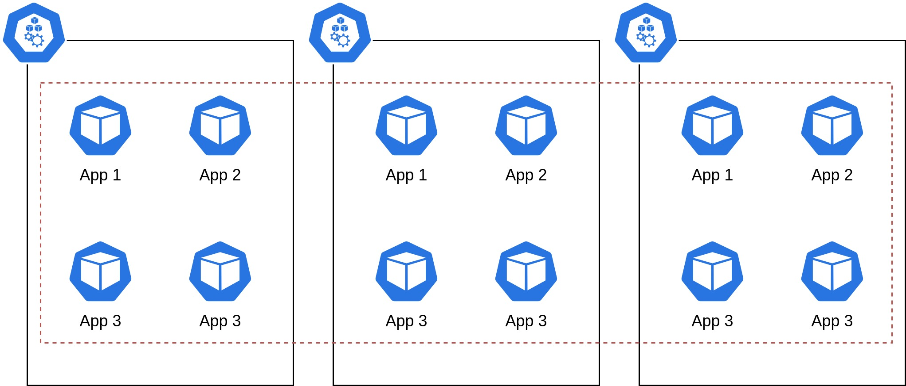
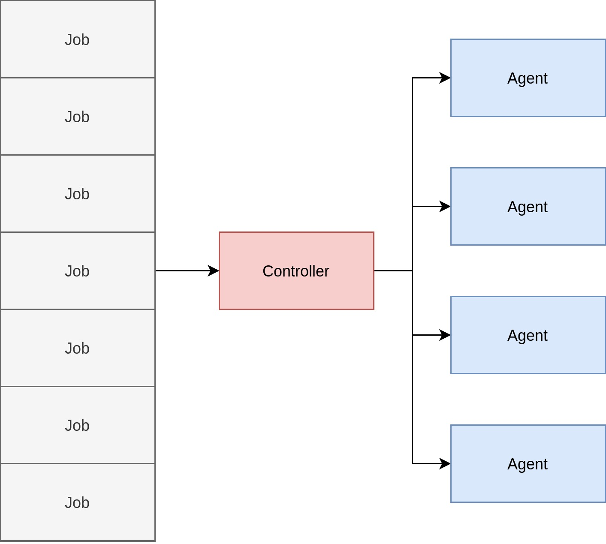

<!-- _paginate: false -->
<!-- _class: lead -->

# Projektkurs

---

# Intro

- Philip Laine
- DevOps Engineer
- Xenit AB
- Gick kursen 2017

---

# Kubernetes
- Open source projekt startad av Google 2015
- Skrivet i Golang
- Platform fär att köra applikationer i containers
- Används i flera olika industrier

---

# Alternativ #1
- Kostnadsoptimering av applikationer
- Flertal applikationer som kör i ett cluster
- Varje app konsumerar CPU och minne
- Upskatta kostnaden av att köra varje applikation

---

# Alternativ #2
- Azure DevOps Agent Operator
- Agenten för att kompilera applikationer
- Kör jobb som kommer från en kö
- Skala mängden agenter utefter storleken på kön

---
