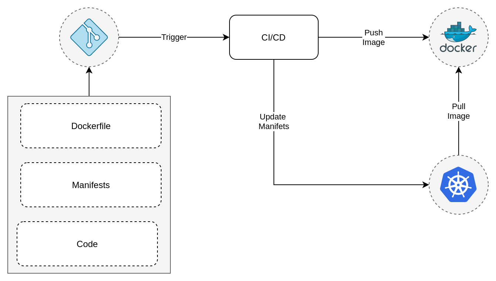
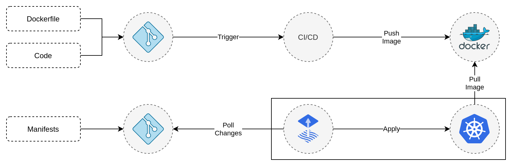
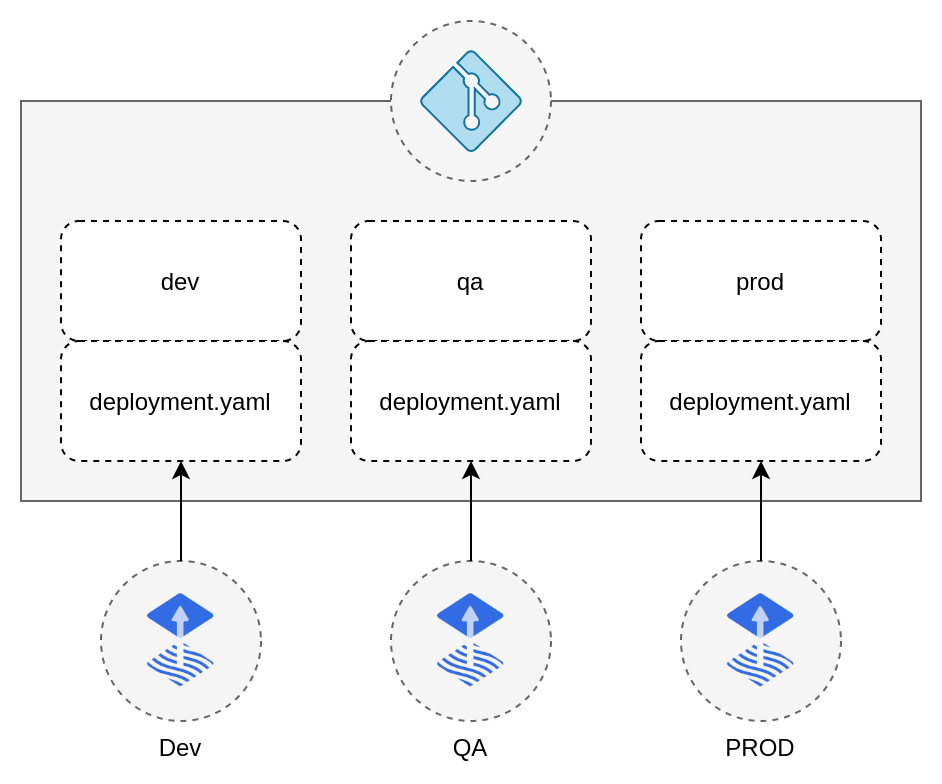

<!-- _paginate: false -->
<!-- _class: lead -->

# GitOps Intro

---

<!-- _paginate: false -->
<!-- _class: lead -->

# Agenda

- Where we are
- Where we can go

---

# Kubernetes

- Declarative
- Flexible
- Dynamic

---

# CI/CD

---

# What is GitOps

- GitOps is a way of working to manage and update infrastructure
- Store desired state in git as the single source of truth
- Automated process to acheive the desired state
- Pull instead of push

---

# Core Principals

1. System is defined declarativly
2. Desired state is stored in git
3. Changes are automatically applied to the system
4. Automatic corrections of divergence from desired state

---

# GitOps

---

# Benefits

- Reduce manifests sprawl
- No cluster configuration required
- Decoupling of CI and CD
- Changes can easily be audited
- Divergences are automatically corrected

---

# Multiple clusters

---

# Resources

- https://toolkit.fluxcd.io/
- https://www.youtube.com/watch?v=0v5bjysXTL8
- https://www.youtube.com/watch?v=nGLpUCPX8JE
- https://www.youtube.com/watch?v=RMZOQwt21EM

---
