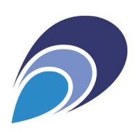
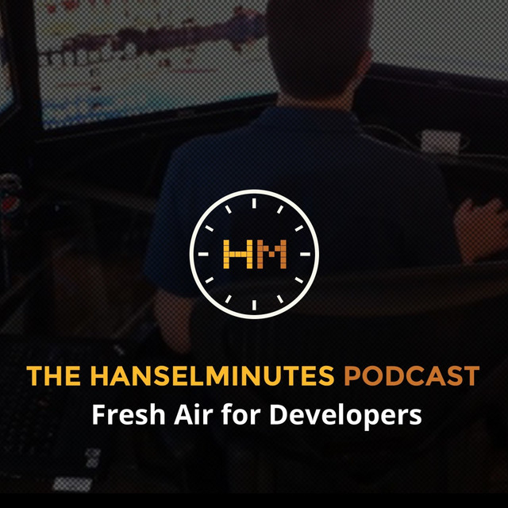

<!-- _paginate: false -->
<!-- _class: lead -->

# Cloud Native GBG Meetup
## #16
---

<!-- _class: lead -->

# Contact Me

- philip.laine@xenit.se
- phillebaba @ Kubernetes Slack

---

<!-- _class: lead -->

## #se-users @ Kubernete Slack
### Kubernetes Slack: https://slack.k8s.io/

---

# Johan Tordsson

- CTO
- Elastisys

---

# Federico Hernandez

- Principal Software Engineer
- Meltwater

---

<!-- _paginate: false -->
<!-- _class: lead -->

# Agenda

- 18.00 - 18.10 Introduction
- 18.10 - 18.50 Security hardening in Kubernetes
- 19.00 - 19.40 Exploring some of the newer features in Kubernetes 1.18+

---

# Meetup #16

- January 14th
- AWS
- TBA
- TBA

---

# Podcast Tip

- Hanselminutes
- Fresh technologies and fresh voices

---
