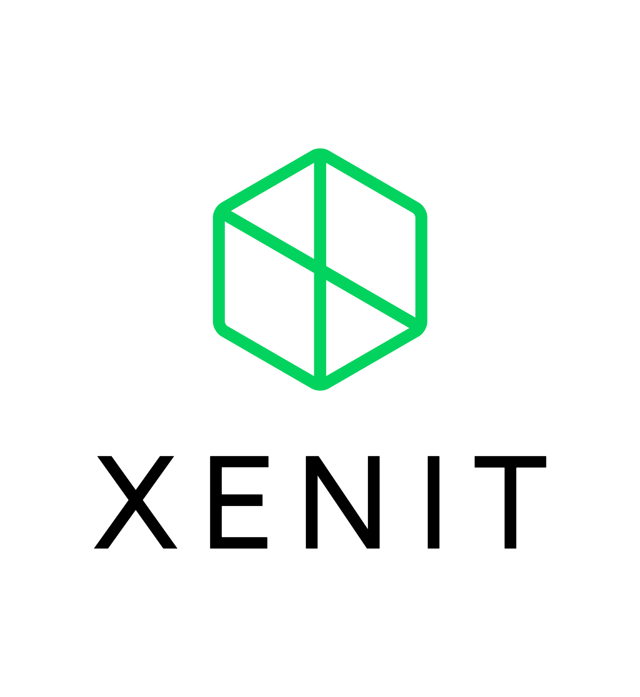
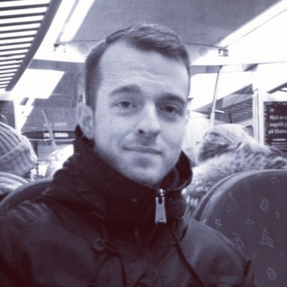
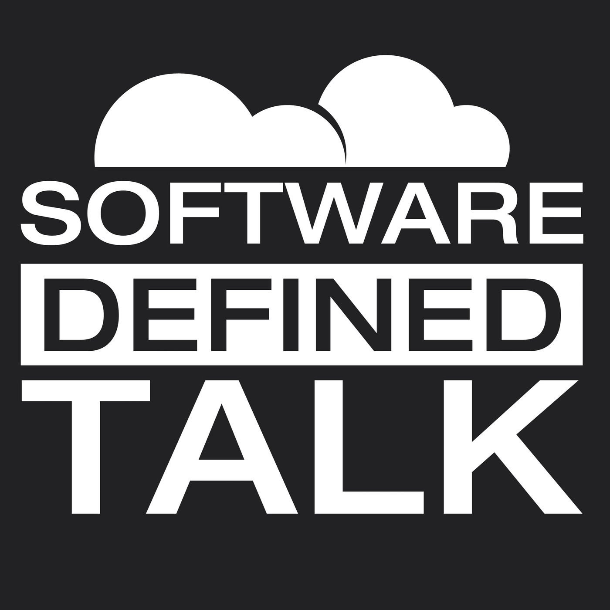

<!-- _paginate: false -->
<!-- _class: lead -->

# Cloud Native GBG Meetup
## #17
---

<!-- _class: lead -->

# Contact Me

- Xenit
- philip.laine@xenit.se
- phillebaba @ Kubernetes Slack

---

<!-- _class: lead -->

## #se-users @ Kubernete Slack
### Kubernetes Slack: https://slack.k8s.io/

---

# Andreas Lindh

- Specialist Solutions Architect
- AWS

---

<!-- _paginate: false -->
<!-- _class: lead -->

# Agenda

- 18.00 - 18.10 Introduction
- 18.10 - 18.50 Packing Pellets, a pattern for maintaining readily available compute capacity
- 19.00 - 19.40 Testing Testing

---

# Meetup #18

- Mid February
- TBA
- TBA
- TBA

---

# Podcast Tip

- Software Defined Talk

---
