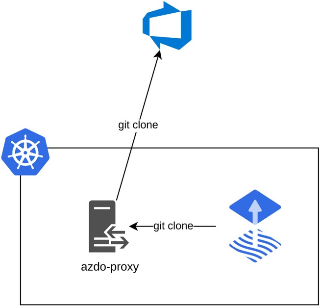
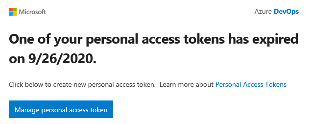

<!-- _paginate: false -->
<!-- _class: lead -->

# PAT Failure Story
## How I messed up

---

# Background

- Personal Access Token (PAT)
- Used to authenticate with Azure DevOps
- No API to automate renewal
- Created per user

---

# GitOps at Xenit

- Azure DevOps repositories
- Flux instance per namespace
- Single PAT shared by [azdo-proxy](https://github.com/XenitAB/azdo-proxy)



---

# What could go wrong?

- Lots of things


---

# What went wrong?



---

## Solution

```golang
ticker := time.NewTicker(1 * time.Minute)
go func() {
  for {
    select {
    case <-ticker.C:
      err = validatePat(config.Pat, config.Organization)
      if err != nil {
        os.Exit(1)
      }
    case <-done:
      ticker.Stop()
      return
    }
  }
}()
```

---

# What i learned

- Fail fast and loud
- Monitor CD

---
