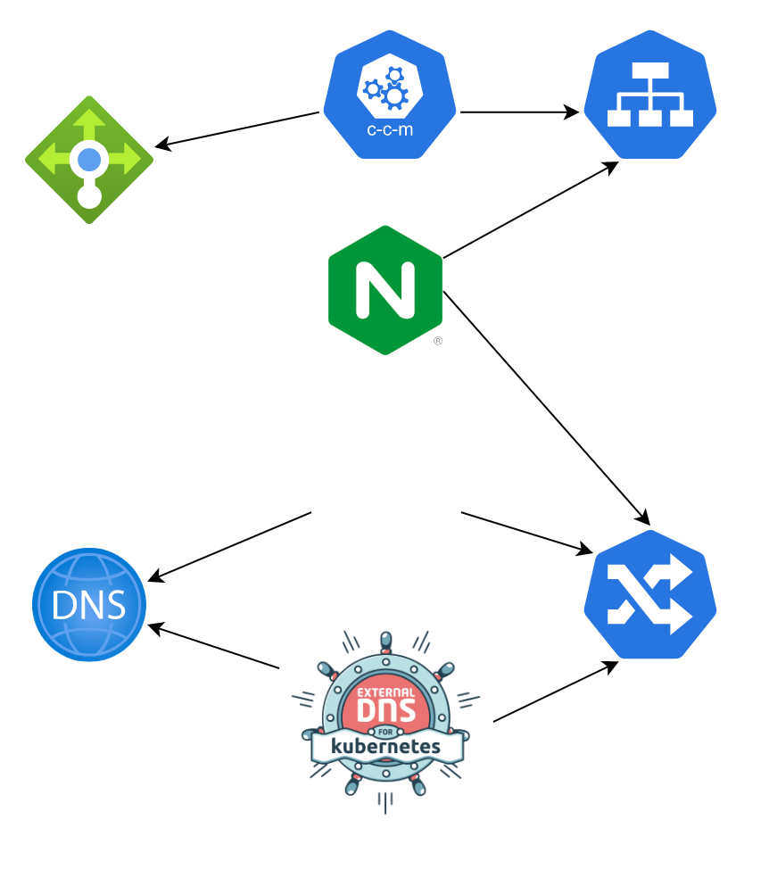
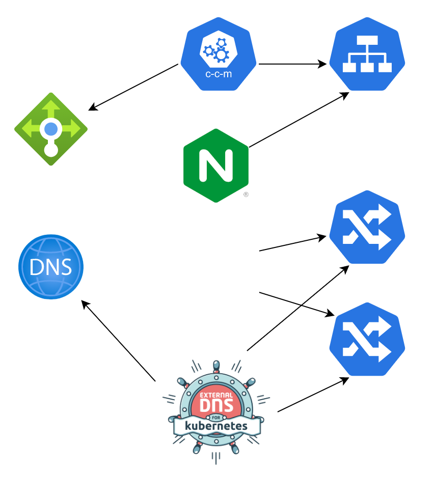
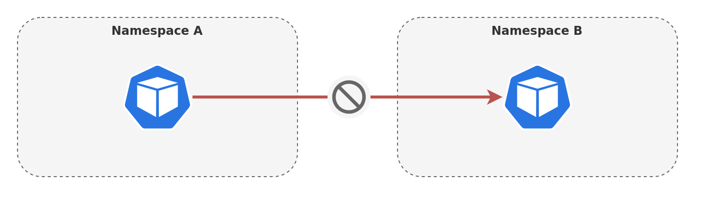

<!-- _paginate: false -->
<!-- _class: lead -->

# Testing Testing
## 123

---

# Ingress Components

- Ingress Controller
- External DNS
- Cert Manager
- Cloud Controller
- Cluster policies

---

# DNS01



---

# HTTP01



---

# Background

- Kubernetes is a complex project
- Made even more complex by "us"
  - Multiple controllers
  - Integrations with cloud provider

---

# Network Policies



---

# Missing out of the box

- kubenet
- flannel
- AWS VPC CNI

---

# Observation

- There is a large focus on testing our applications
- Less common to test our Kubernetes clusters
  - How do you know your new cluster works?

---

# What should we test

- Functional testing
  - Nodes ready
  - kube-system running
  - Ingress
  - Metrics/Log exporters
- Security
  - Network Policy
  - Priveleged Containers
  - Policy enforcment

---

<!-- _class: lead -->

# Do Not Test Kubernetes

---

# Options

- Bash
- Tekton + container
- Kubernetes e2e
- kube-bench
- Troubleshoot
- Sonobuoy

---

# Troubleshoot

- Developed by Replicated
- Installed as a kubectl plugin
- Simple and easy

---

```
apiVersion: troubleshoot.sh/v1beta2
kind: Preflight
metadata:
  name: minimum-node-count
spec:
  collectors: []
  analyzers:
    - nodeResources:
        checkName: Must have at least 3 nodes in the cluster
        outcomes:
          - fail:
              when: count() < 3
              message: This application requires at least 3 nodes
          - warn:
              when: count() < 6
              message: This application recommends at last 6 nodes.
          - pass:
              message: This cluster has enough nodes.
```

---

# Sonobuoy

- Developed by VMWare
- Tool to run other test plugins
  - Including Kubernetes e2e
- Maximum flexibility with more complexity
- Each plugin runs in its own container
- Sonobuoy agregates results

---

# Challenges

- Complex tests vs. fast tests
- When to run the tests
- How often to run the tests
- Testing or Alerts

---
