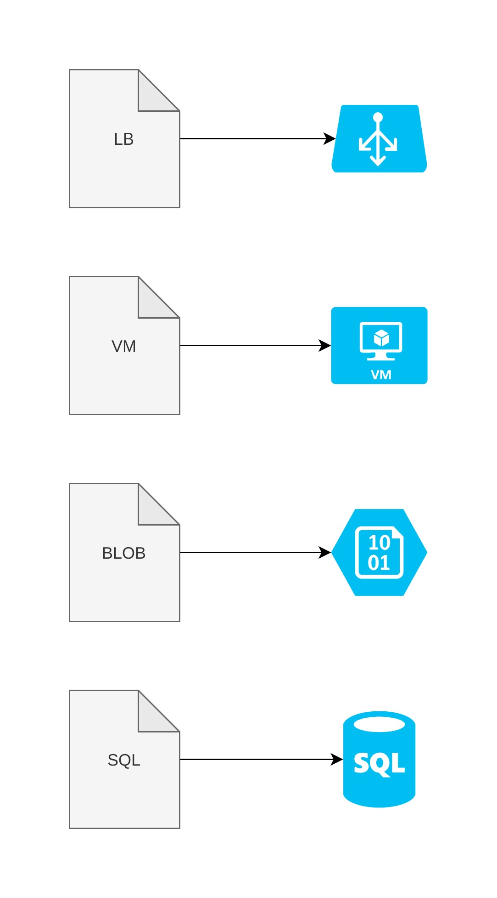
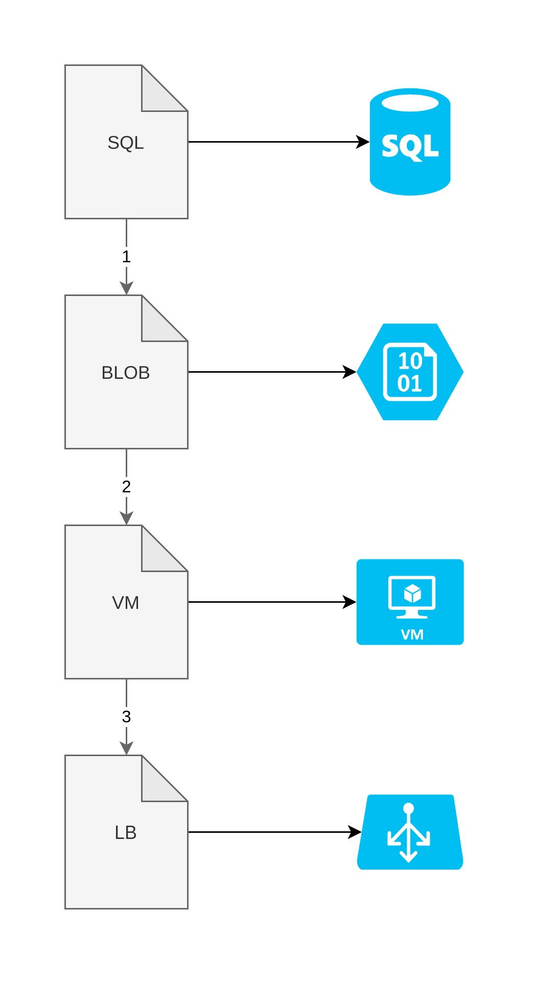
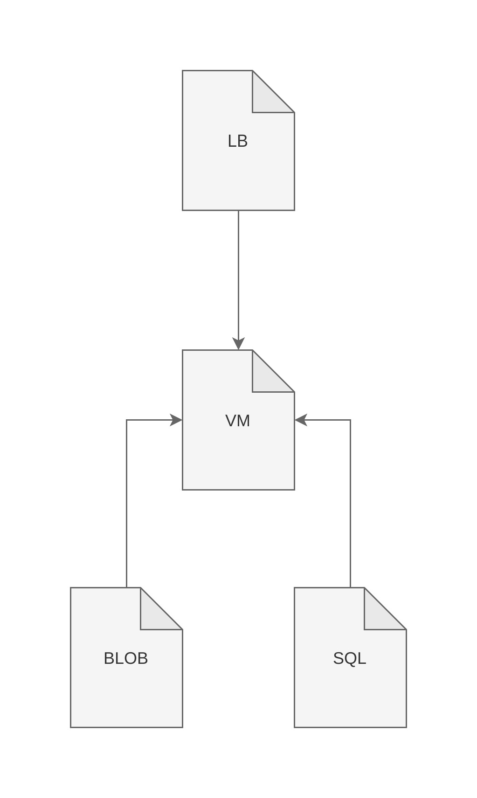
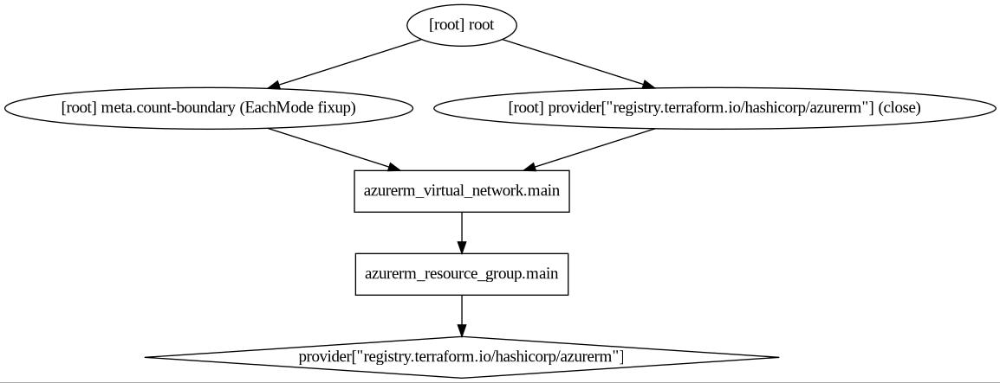
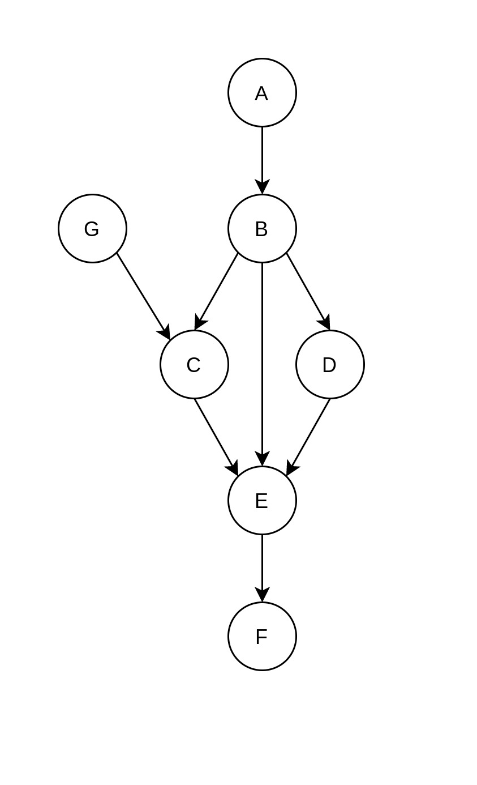

<!-- _paginate: false -->
<!-- _class: lead -->

# Terraform Core
## Basics

---

<!-- _paginate: false -->
<!-- _class: lead -->

# Agenda

- Landscape
- Core
- Scale

---

# Vendor Landscape

- Cloud Formation
- ARM Templates
- AWS CDK
- SDKs

---

# Agnostic Landscape

- Terraform
- Ansible
- Pulumi
- Puppet
- https://landscape.cncf.io/category=automation-configuration&format=card-mode&grouping=category

---

# Differences

- Language
  - JSON
  - HCL
  - Python or Typescript
- Execution Method

---

# All at once

- All resources are applied at once
- Alternativly the order is random
- No dependency between resources



---

# Top to bottom

- Line by line
- Order is always the same
- Pass output as input
- Every step will be run



---

# Example

https://github.com/XenitAB/cloud-automation/blob/master/azure/packer/azure-pipelines-agent/ubuntu1804-ansible.yaml

---

# Dependency based

- Order is based on dependencies
- Calculate desired state



---

# Example

```hcl
provider "azurerm" {
  features = {}
}
resource "azurerm_resource_group" "main" {
  name     = "${var.prefix}-resources"
  location = "West US 2"
}
resource "azurerm_virtual_network" "main" {
  name                = "${var.prefix}-network"
  address_space       = ["10.0.0.0/16"]
  location            = azurerm_resource_group.main.location
  resource_group_name = azurerm_resource_group.main.name
}
```

---

# Result



---

# Directed Acyclyc Graph

- Vertex - Circles
- Edge - Lines
- Directed - Edges have direction
- Acyclyc - No loops in the graph



---

# Terraform Core

- Does the heavy lifting
- Calculates order of the graph
- Calculates desired state vs current state

---

# Providers

- Implements the resources
- Link between Terraform and Cloud API
- CRUD for each resource
- https://registry.terraform.io/browse/providers

---

# Benefits of Terraform

- Possible to delete what has been created
- Plan before apply
- Easily recover manual changes

---

# When not to use Terraform

- OS configuration
  - Packer
- Existing infrastructure
  - Can be tricky to import
- File templating
- Logic heavy processes
  - Avoid shelling out

---

# Terraform at scale

- Modules, modules, modules
  - Custom resource type
  - Modules allow you to resuse terraform
  - Reference modules with git
- Combine modules with other modules

---

# Example

```hcl
module "azpagent" {
  source = "github.com/xenitab/terraform-modules//modules/azure
            /azure-pipelines-agent-vmss?ref=main"

  environment                      = "dev"
  location_short                   = "we"
  name                             = "azpagent"
  azure_pipelines_agent_image_name = "azp-agent-2020-11-16T22-24-11Z"
  vmss_sku                         = "Standard_B2s"
  vmss_subnet_config = {
    name                 = "sn-dev-we-hub-servers"
    virtual_network_name = "vnet-dev-we-hub"
    resource_group_name  = "rg-dev-we-hub"
  }
}
```

---

# Resources

- https://www.youtube.com/watch?v=Ce3RNfRbdZ0
- https://github.com/XenitAB/terraform-modules
- https://www.packer.io/

---
